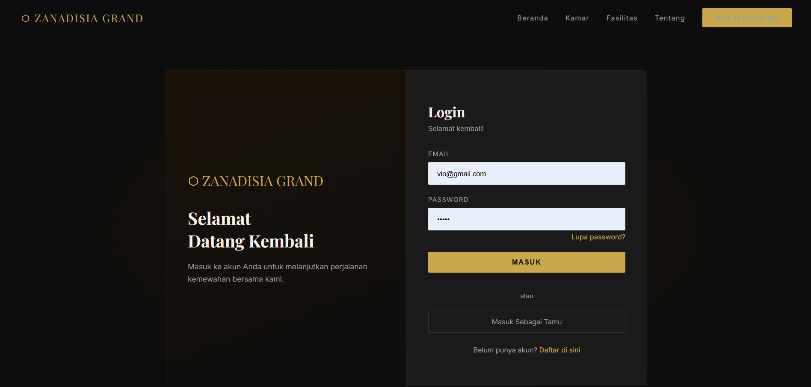
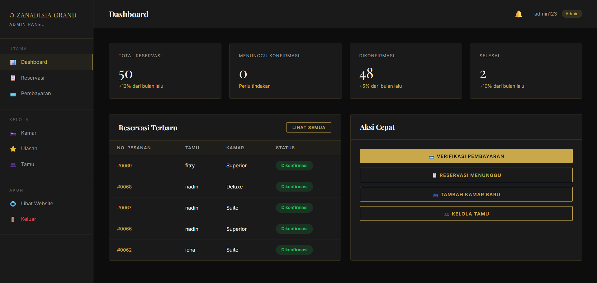
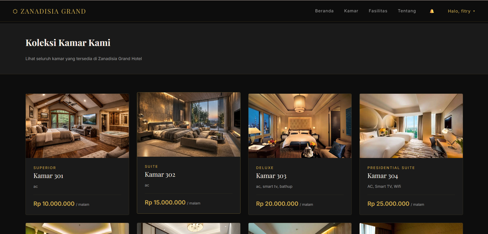
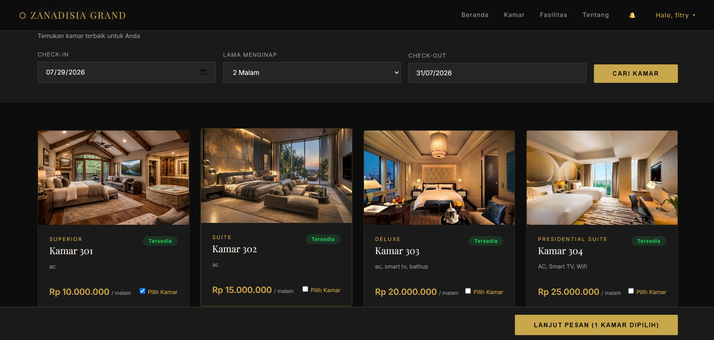
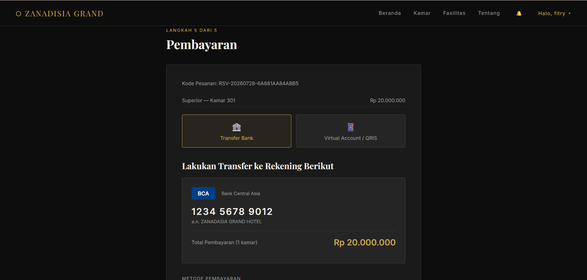
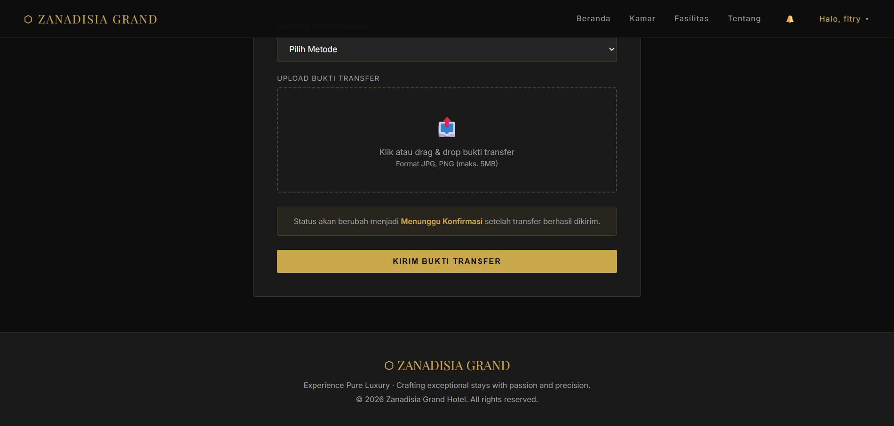
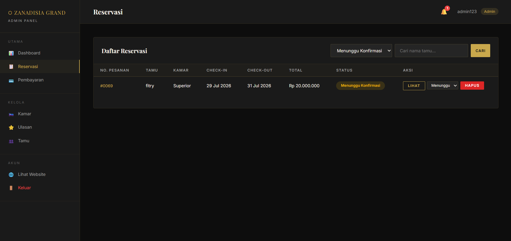
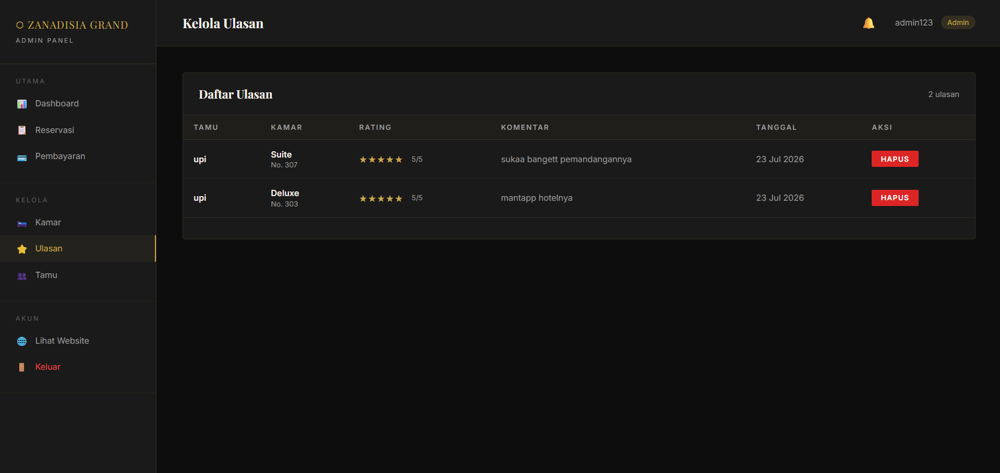

# 🏨 Hotel Booking System

Sistem Hotel Booking merupakan aplikasi berbasis web yang dikembangkan menggunakan Laravel Framework untuk mempermudah proses pemesanan kamar hotel secara online. Aplikasi ini menyediakan fitur bagi pelanggan untuk melakukan reservasi kamar, mengunggah bukti pembayaran, melihat status reservasi, memberikan ulasan, serta bagi admin untuk mengelola data kamar dan mengonfirmasi reservasi.

---

# 📖 Deskripsi Project

Project ini dibuat sebagai tugas mata kuliah Pemrograman Web Lanjut A2 dengan tujuan membangun sistem reservasi hotel yang lebih efektif dan efisien. Seluruh data tersimpan pada database MySQL sehingga memudahkan pengelolaan informasi kamar, reservasi, pembayaran, dan pengguna.

---

## ✨ Fitur Utama

### 👤 Fitur User

**Registrasi akun**
Pengguna dapat membuat akun baru dengan mengisi data diri yang diperlukan agar dapat mengakses layanan pemesanan kamar hotel.

**Login dan Logout**
Pengguna dapat masuk ke dalam sistem menggunakan akun yang telah terdaftar dan dapat keluar dari sistem setelah selesai menggunakan aplikasi.

**Melihat daftar kamar**
Pengguna dapat melihat informasi kamar yang tersedia, termasuk nama kamar, harga, fasilitas, kapasitas, dan foto kamar.

**Mencari kamar berdasarkan tanggal check-in dan check-out**
Pengguna dapat mencari ketersediaan kamar berdasarkan tanggal menginap sehingga sistem hanya menampilkan kamar yang dapat dipesan.

**Melakukan reservasi kamar**
Pengguna dapat melakukan pemesanan kamar dengan mengisi data reservasi sesuai kebutuhan seperti tanggal menginap dan informasi tamu.

**Upload bukti pembayaran**
Pengguna dapat mengunggah bukti pembayaran sebagai proses konfirmasi pembayaran kepada pihak admin.

**Melihat status reservasi**
Pengguna dapat melihat perkembangan status pemesanan kamar, seperti menunggu konfirmasi, diterima, atau ditolak oleh admin.

**Menerima notifikasi konfirmasi reservasi**
Pengguna akan mendapatkan informasi mengenai perubahan status reservasi setelah admin melakukan pengecekan dan konfirmasi.

**Memberikan ulasan hotel**
Pengguna dapat memberikan penilaian dan ulasan terhadap layanan hotel setelah melakukan reservasi.

### 👨‍💼 Fitur Admin

**Login Admin**
Admin dapat masuk ke halaman khusus admin untuk mengelola seluruh aktivitas pada sistem hotel booking.

**Dashboard Admin**
Admin dapat melihat ringkasan informasi sistem seperti jumlah kamar, data reservasi, pembayaran, dan aktivitas pengguna.

**Mengelola data kamar (Tambah, Edit, Hapus)**
Admin dapat menambahkan data kamar baru, memperbarui informasi kamar, serta menghapus data kamar yang sudah tidak digunakan.

**Mengelola data reservasi**
Admin dapat melihat seluruh data pemesanan kamar yang dilakukan oleh pengguna melalui sistem.

**Mengonfirmasi reservasi pelanggan**
Admin dapat melakukan pengecekan reservasi dan memberikan keputusan berupa konfirmasi atau penolakan pemesanan.

**Mengubah status kamar secara otomatis**
Sistem akan memperbarui status ketersediaan kamar berdasarkan reservasi yang telah dikonfirmasi sehingga kamar yang sudah dipesan tidak dapat dipilih kembali.

**Melihat data pembayaran**
Admin dapat melihat informasi pembayaran serta memeriksa bukti pembayaran yang dikirimkan oleh pengguna.

**Mengelola ulasan pelanggan**
Admin dapat melihat dan mengelola ulasan yang diberikan pelanggan sebagai bahan evaluasi pelayanan hotel.

---

# 🛠 Teknologi yang Digunakan

- Laravel
- PHP
- MySQL
- HTML5
- CSS3
- Bootstrap
- JavaScript
- XAMPP
- Visual Studio Code

---

# 📂 Struktur Project

```
hotel-booking
│
├── app
├── bootstrap
├── config
├── database
├── public|
├── resources
├── routes
├── storage
├── artisan
├── composer.json
└── README.md
```

---

# ⚙️ Cara Instalasi

## 1. Clone Repository

```bash
git clone https://github.com/username/hotel-booking.git
```

## 2. Masuk ke Folder Project

```bash
cd hotel-booking
```

## 3. Install Dependency

```bash
composer install
```

## 4. Salin File Environment

```bash
cp .env.example .env
```

## 5. Generate Application Key

```bash
php artisan key:generate
```

## 6. Konfigurasi Database

Buat database dengan nama:

```
hotel_booking
```

Kemudian ubah file **.env**

```env
DB_CONNECTION=mysql
DB_HOST=127.0.0.1
DB_PORT=3306
DB_DATABASE=hotel_booking
DB_USERNAME=root
DB_PASSWORD=
```

## 7. Jalankan Migration

```bash
php artisan migrate
```

Apabila memiliki file database (.sql), import terlebih dahulu melalui phpMyAdmin.

## 8. Menjalankan Aplikasi

```bash
php artisan serve
```

Kemudian buka browser:

```
http://127.0.0.1:8000
```

---

# 🗄 Database

Nama Database

```
hotel_booking
```

Tabel utama:

- users
- kamars
- reservasis
- pembayarans
- ulasans
- notifications

---

# 📸 Tampilan Sistem

## Halaman Login



---

## Dashboard Admin



---

## Dashboard User


---

## Daftar Kamar



---

## Halaman Reservasi



---

## Halaman Pembayaran

### Pembayaran 1



### Pembayaran 2



---

## Halaman Notifikasi

### Notifikasi 1



### Notifikasi 2


---

## Halaman Ulasan



---

# 👥 Tim Pengembang

nama anggota kelompok 4

- Nada Amal Ceria (240170018)
- Anisah (240170040)
- Muthia Zahira (240170090)

---

# 📄 Lisensi

Project ini dibuat untuk keperluan pembelajaran dan tugas perkuliahan Pemrograman Web Lanjut A2.

---

# ❤️ Terima Kasih

Terima kasih telah mengunjungi repository ini. Semoga project ini bermanfaat sebagai referensi dalam pengembangan aplikasi reservasi hotel menggunakan Laravel.